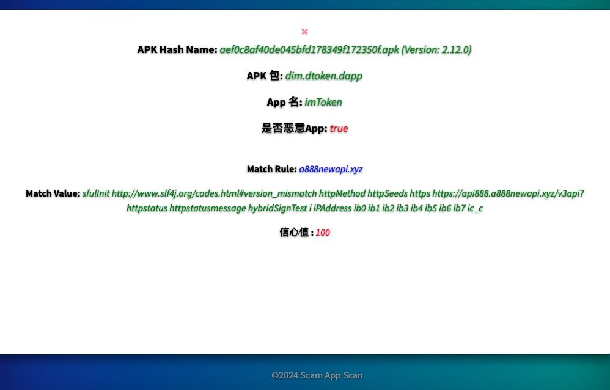

# ScamAppScan Web

ScamAppScan 的Web服务。前端采用MobSF的上传模版，后端采用Flask。可以点击或者拖拽APK 文件到服务端进行分析。


## 安装第三方模块
```shell
python3 -m pip install -r requirement.txt -i https://pypi.tuna.tsinghua.edu.cn/simple

```

### 启动
```shell
# 调试模式
.venv/bin/flask run -p 8000 -h 0.0.0.0 --debug

# 可以使用 gunicorn 启动
# -w WORKERS, --workers=WORKERS 设置工作进程数。建议服务器每一个核心可以设置2-4个。
# -b BIND, --bind=BIND 设定服务需要绑定的端口。建议使用HOST:PORT。
# 指定进程和端口号： -w: 表示进程（worker）。 -b：表示绑定ip地址和端口号（bind）。 -D: 后台运行
# gevent 异步工作模式

python3 -m gunicorn --preload -w 4 -b 0.0.0.0:8000 -k gevent --timeout 100 -D --access-logfile access.log --error-logfile error.log run:app
```
**结果展示**

