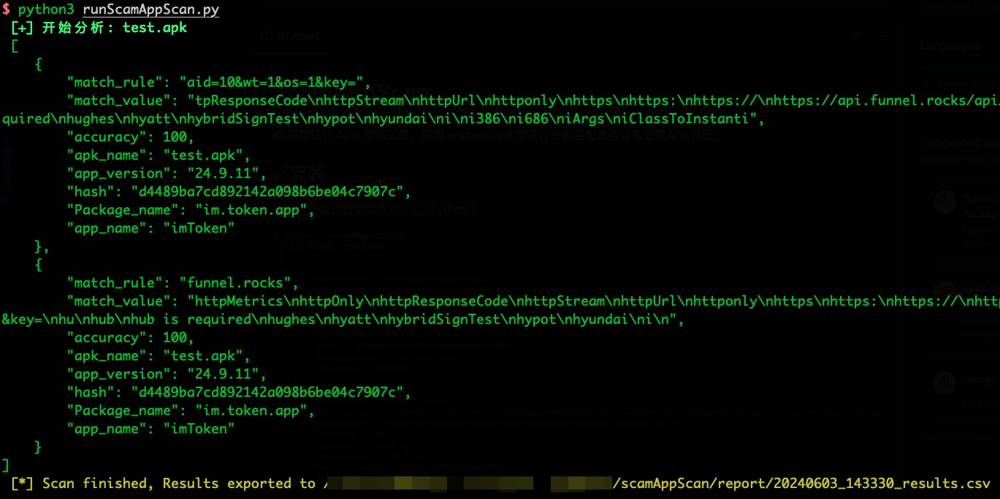

# ScamAppScan

👊**恶意 APK 检测工具，对恶意APK进行分析匹配是否含有恶意APK特征。**

**默认采用 androguard (仅Python第三方库)库方案作为首选，备选方案是 aapt 工具（MacOS & linux） + apktool.jar（需要有java环境支持， tools 有二进制文件，可自行更新或者添加windows端）**



## 🌲目录结构

```shell
├── Web                             # Web端，前端采用MobSF的上传模版，后端采用Flask
├── apkStore                        # 恶意APK存放此文件夹
├── config.py                       # 配置文件，包括恶意APK匹配规则，APK壳检测规则等
├── docs                            # 文档相关文件
├── readme.md                       # 本说明文档
├── report                          # 报告目录，运行本项目自动生成
├── runScamAppScan.py               # 主文件，入口文件
└── utils
    ├── apkAnalyzer.py              # APK分析模块
    ├── apkShellDetector.py         # APK壳检测模块
    └── reportGenerator.py          # 报告导出模块
```

## 🚀安装

本项目开发语言版本采用：🐍 Python 3

### 安装第三方依赖

只有一个第三方依赖库，`whl`文件放在了utils目录

```shell
python3 -m pip install ./utils/androguard-4.1.1-py3-none-any.whl -i https://pypi.tuna.tsinghua.edu.cn/simple
```

如果你担心依赖影响系统版本，可以考虑使用虚拟环境。

## 运行脚本
```shell
python3 runScamAppScan.py
```

**搭建虚拟环境**
```shell
python3 -m venv .venv
```
**启动虚拟环境**
```shell
source .venv/bin/activate
```

**在虚拟环境下安装模块**
```shell
python3 -m pip install ./utils/androguard-4.1.1-py3-none-any.whl -i https://pypi.tuna.tsinghua.edu.cn/simple
```

**退出虚拟环境**
```shell
deactivate
```

## APK 存放
可以放入多个待检测的APK到apkStore目录，项目会自动批量检测。

## Web 安装和启动
📝[点击跳转](https://github.com/Re13orn/scamAppScan/blob/main/Web/readme.md)